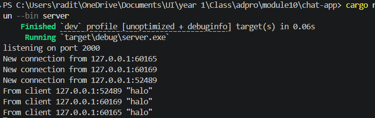
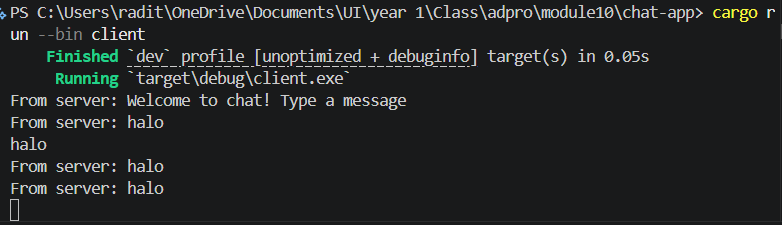
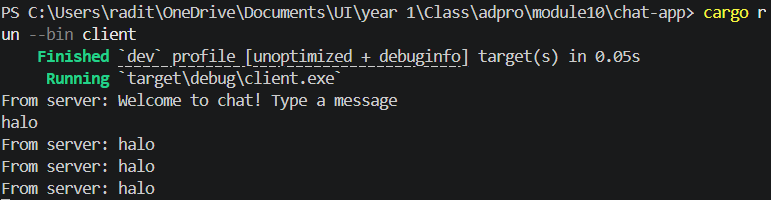
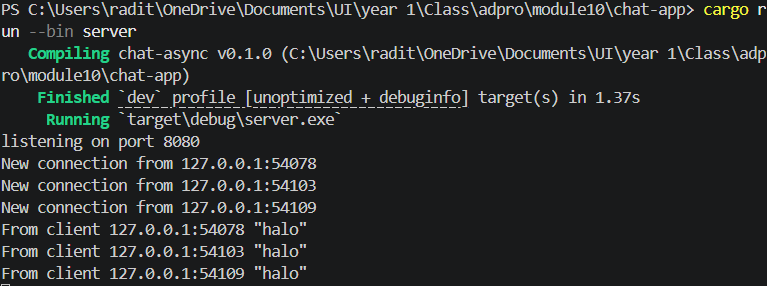
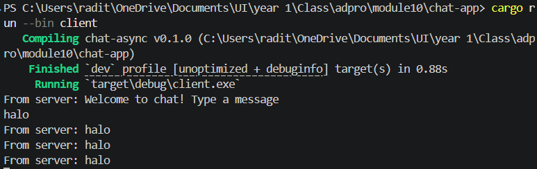
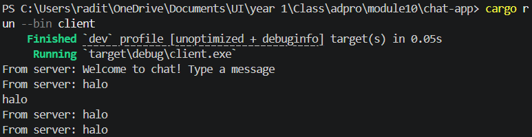
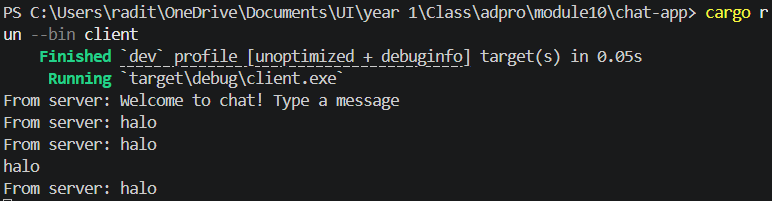

# Tutorial 1: Timer

## Experiment 1.1: Original Timer from the Book

I implemented the timer example from chapter 2.3 of the Async Book.
The program spawns one async task that prints "howdy!", awaits a `TimerFuture` for 2 seconds, then prints "done!".
The executor polls the future, sees it's still pending, and only wakes it up once the timer thread signals completion via the `Waker`.

## Experiment 1.2: Understanding How It Works

I added a `println!("hey hey")` right after `spawner.spawn(...)`.
The "hey hey" line printed before "howdy!", even though `spawn` was called first.
This is because `spawner.spawn()` only queues the future into the task channel — nothing runs until `executor.run()` is called.
The `println!` outside the async block runs synchronously on the main thread, so it executes immediately, while the spawned task has to wait for the executor to start polling it.

## Experiment 1.3: Multiple Spawn and Removing Drop

I duplicated the spawn block three times (howdy/howdy2/howdy3) and observed two things.
First, all three "howdy" messages printed almost simultaneously, then after a 2-second pause all three "done" messages appeared together.
This proves the tasks run concurrently on a single thread, since while one task awaits its timer the executor polls the others.
Second, when I commented out `drop(spawner)`, the program hung after printing the "done" lines.
This happens because the executor's `recv()` loop keeps waiting for new tasks as long as a `task_sender` is still alive.
Dropping the spawner closes the channel, telling the executor no more tasks are coming so it can exit cleanly.

# Tutorial 2: Broadcast Chat

## Experiment 2.1: Original Code

The broadcast chat application uses a Tokio WebSocket server on `127.0.0.1:2000` and multiple clients that connect to it.
The server holds a `tokio::sync::broadcast` channel so every message received from one client is fanned out to all connected clients.
Both server and client use `tokio::select!` to concurrently handle multiple async streams.
The server races client input against broadcast messages, while the client races stdin against incoming server messages.
To run it, start the server with `cargo run --bin server`, then open three more terminals running `cargo run --bin client` each.
Anything typed in one client appears in all three, and the server logs every connection and message with the sender's IP and port.

## Experiment 2.2: Modifying the WebSocket Port

I changed the WebSocket port from `2000` to `8080`.
Because a WebSocket connection has two sides, the change had to be made in two files: `src/bin/server.rs` where `TcpListener::bind` defines the address the server listens on, and `src/bin/client.rs` where `ClientBuilder::from_uri` defines which address the client connects to.
Both sides also use the same `ws://` scheme, which is the WebSocket protocol defined inside the client's URI string — the server doesn't need to declare the protocol explicitly because `ServerBuilder::new().accept(socket)` performs the WebSocket handshake on top of the raw TCP connection.
After updating both files, the application still runs correctly with all clients connecting on port 8080.

